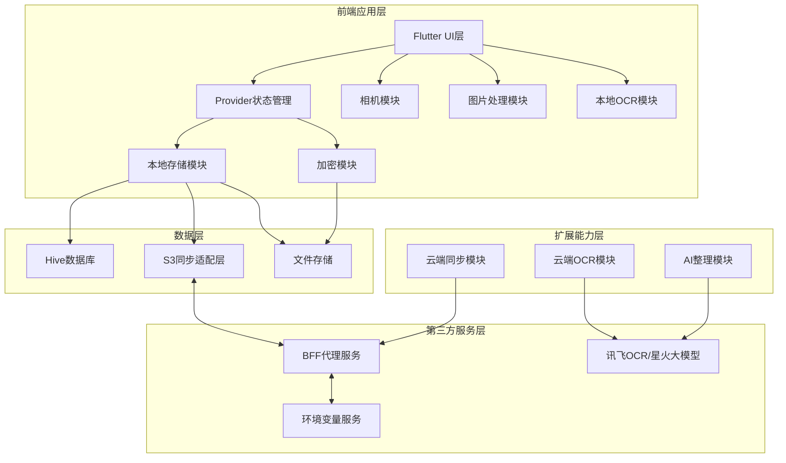
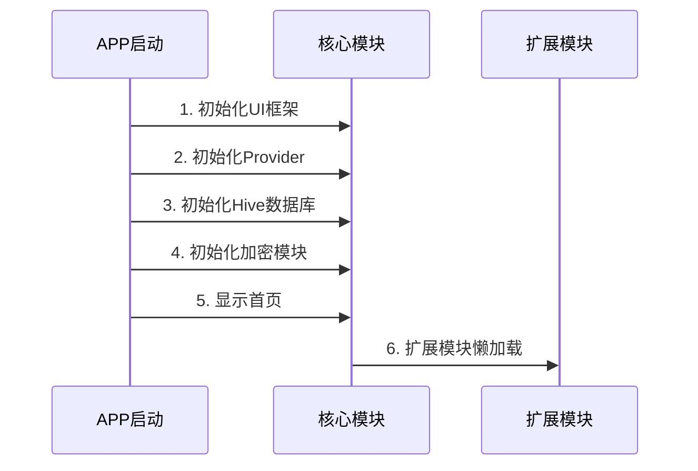
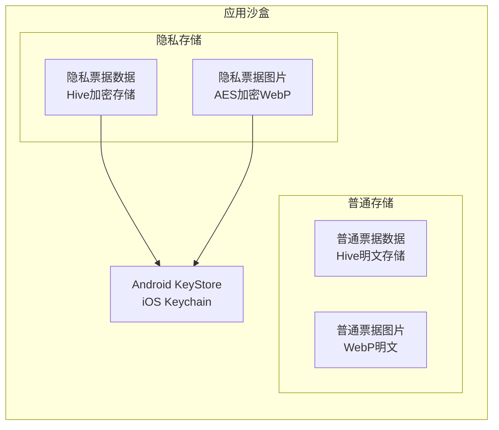
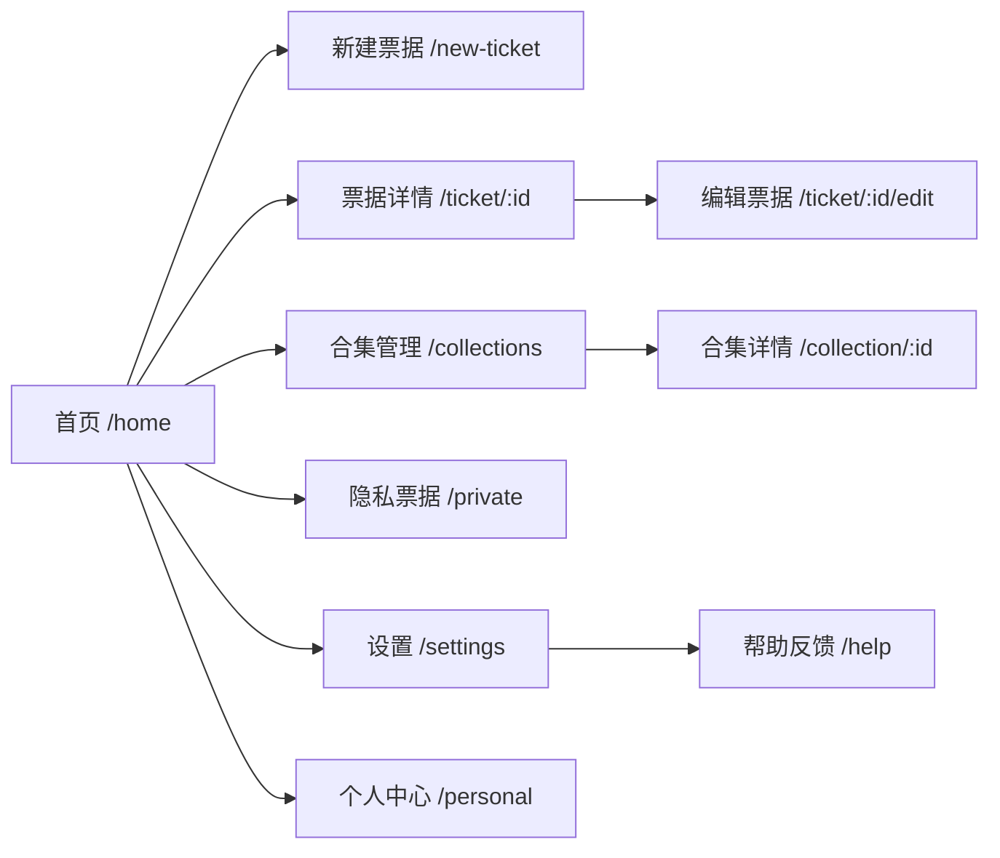
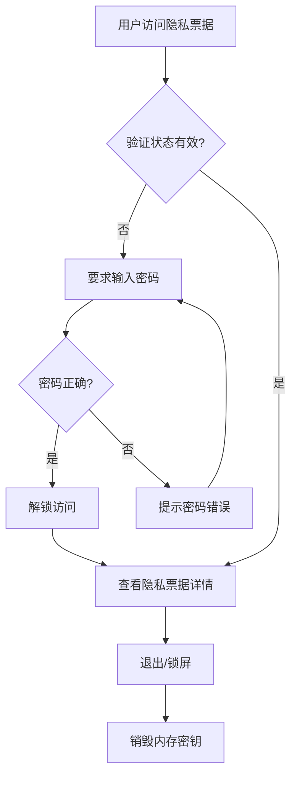
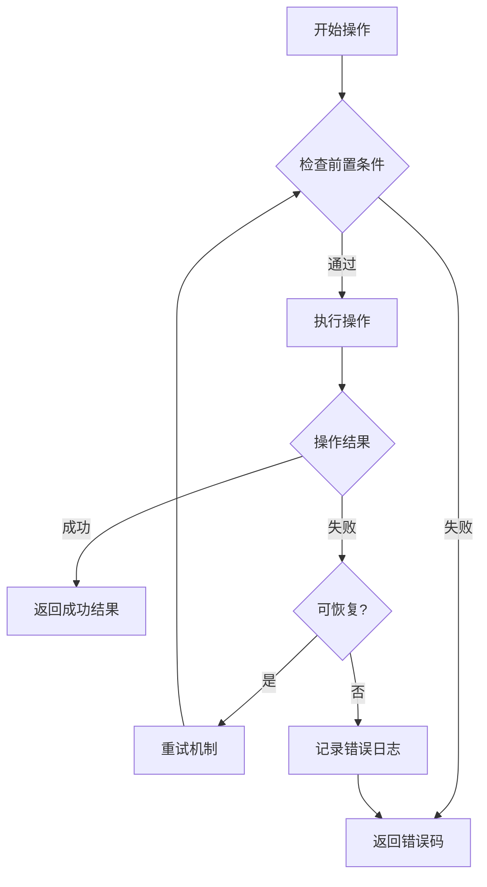

# 票密夹APP技术设计文档

Feature Name: ticket-vault
Updated: 2026-04-02

## 1. 概述

票密夹是一款面向个人用户的私密高效票据电子化管理APP，采用Flutter跨平台框架开发，遵循「端云分离、本地优先、组件化、S3协议适配」的四层架构原则。

### 1.1 架构原则

- 核心功能100%离线可用
- 扩展能力模块化插拔
- 兼顾性能、隐私与迁移性
- 本地数据为唯一权威源

### 1.2 技术栈概览

| 层级 | 技术选型 |
|------|---------|
| 前端框架 | Flutter 3.x |
| 本地数据库 | Hive 2.x（支持加密） |
| 图片处理 | OpenCV Flutter |
| OCR引擎 | Google ML Kit Text Recognition v2 |
| 状态管理 | Provider |
| 加密方案 | AES-256-GCM |
| 云端存储 | S3兼容对象存储 |
| BFF服务 | Node.js + Express |
| 环境变量 | 1Panel静态网站 |

### 1.3 数据库选型理由

| 特性 | Hive | Isar |
|------|------|------|
| 维护状态 | 活跃维护中 | 已停止维护 |
| Flutter 3兼容 | 良好 | 存在兼容性问题 |
| 加密支持 | 内置支持 | 需额外配置 |
| 体积 | <500KB | <1MB |
| 依赖 | 无原生依赖 | 无原生依赖 |
| 适用场景 | Key-Value存储、简单对象 | 复杂关系查询 |

**结论**：选择Hive作为本地数据库，满足票据存储需求且技术可持续。

## 2. 系统架构

### 2.1 整体架构图



### 2.2 模块初始化顺序



### 2.3 隐私票据存储架构



## 3. 目录结构

```
lib/
├── main.dart                    # 应用入口
├── app.dart                     # APP配置
├── routes/                      # 路由配置
│   └── app_routes.dart
├── models/                      # 数据模型
│   ├── ticket.dart              # 票据模型
│   ├── collection.dart          # 合集模型
│   ├── user_account.dart        # 用户账号模型
│   └── sync_status.dart         # 同步状态枚举
├── providers/                   # 状态管理
│   ├── ticket_provider.dart
│   ├── collection_provider.dart
│   ├── auth_provider.dart
│   ├── sync_provider.dart
│   └── settings_provider.dart
├── services/                    # 服务层
│   ├── database_service.dart    # Hive数据库服务
│   ├── storage_service.dart     # 文件存储服务
│   ├── crypto_service.dart      # 加密服务
│   ├── ocr_service.dart        # OCR服务
│   ├── sync_service.dart        # 同步服务
│   └── backup_service.dart      # 备份恢复服务
├── repositories/                # 数据仓库
│   ├── ticket_repository.dart
│   └── collection_repository.dart
├── widgets/                     # 通用组件
│   ├── ticket_card.dart
│   ├── private_ticket_card.dart
│   ├── collection_picker.dart
│   └── password_input.dart
├── pages/                      # 页面
│   ├── home_page.dart
│   ├── new_ticket_page.dart
│   ├── ticket_detail_page.dart
│   ├── collection_page.dart
│   ├── private_tickets_page.dart
│   ├── settings_page.dart
│   └── personal_center_page.dart
└── utils/                      # 工具类
    ├── image_processor.dart
    ├── date_formatter.dart
    └── validators.dart
```

## 4. 数据模型

### 4.1 票据模型 (Ticket)

```dart
@HiveType(typeId: 0)
class Ticket extends HiveObject {
  @HiveField(0)
  String id;                      // UUID
  
  @HiveField(1)
  String title;                   // 标题
  
  @HiveField(2)
  String? ocrText;                // OCR识别文本
  
  @HiveField(3)
  String? description;           // AI整理的简介
  
  @HiveField(4)
  List<String> tags;             // 标签列表
  
  @HiveField(5)
  String? collectionId;          // 合集ID
  
  @HiveField(6)
  String? location;              // 位置信息
  
  @HiveField(7)
  DateTime createTime;           // 创建时间
  
  @HiveField(8)
  DateTime updateTime;           // 修改时间
  
  @HiveField(9)
  DateTime? dueDate;             // 到期日期
  
  @HiveField(10)
  bool isPrivate;                 // 是否为隐私票据
  
  @HiveField(11)
  String? imagePath;              // 图片路径
  
  @HiveField(12)
  String? thumbnailPath;          // 缩略图路径
  
  @HiveField(13)
  SyncStatus syncStatus;          // 同步状态
  
  @HiveField(14)
  int version;                   // 版本号
  
  @HiveField(15)
  int syncTimestamp;             // 同步时间戳
}
```

### 4.2 合集模型 (Collection)

```dart
@HiveType(typeId: 1)
class Collection extends HiveObject {
  @HiveField(0)
  String id;                      // UUID
  
  @HiveField(1)
  String name;                    // 合集名称
  
  @HiveField(2)
  String? coverPath;              // 封面图片路径
  
  @HiveField(3)
  DateTime createTime;
  
  @HiveField(4)
  DateTime updateTime;
  
  @HiveField(5)
  bool isDefault;                // 是否为默认合集
  
  @HiveField(6)
  bool isDeleted;                // 软删除标记
}
```

### 4.3 用户账号模型 (UserAccount)

```dart
@HiveType(typeId: 2)
class UserAccount extends HiveObject {
  @HiveField(0)
  String id;                      // UUID
  
  @HiveField(1)
  String? phoneNumber;           // 手机号
  
  @HiveField(2)
  String? email;                  // 邮箱
  
  @HiveField(3)
  String passwordHash;           // 密码哈希
  
  @HiveField(4)
  AccountStatus status;          // 账号状态
  
  @HiveField(5)
  DateTime createTime;
  
  @HiveField(6)
  DateTime lastLoginTime;
  
  @HiveField(7)
  List<DeviceInfo> devices;       // 登录设备列表
  
  @HiveField(8)
  MemberType memberType;          // 会员类型
  
  @HiveField(9)
  DateTime? memberExpireTime;    // 会员过期时间
}

@HiveType(typeId: 3)
class DeviceInfo {
  @HiveField(0)
  String deviceId;
  
  @HiveField(1)
  String deviceName;
  
  @HiveField(2)
  DateTime lastActiveTime;
}
```

### 4.4 枚举定义

```dart
@HiveType(typeId: 10)
enum SyncStatus {
  @HiveField(0)
  notSynced,     // 未同步
  
  @HiveField(1)
  syncing,       // 同步中
  
  @HiveField(2)
  synced,        // 已同步
  
  @HiveField(3)
  failed         // 同步失败
}

@HiveType(typeId: 11)
enum AccountStatus {
  @HiveField(0)
  active,        // 正常
  
  @HiveField(1)
  frozen,        // 冻结
  
  @HiveField(2)
  deleted       // 已注销
}

@HiveType(typeId: 12)
enum MemberType {
  @HiveField(0)
  free,          // 免费用户
  
  @HiveField(1)
  monthly,       // 月度会员
  
  @HiveField(2)
  yearly         // 年度会员
}

@HiveType(typeId: 13)
enum DeleteCollectionOption {
  @HiveField(0)
  moveToUncategorized,  // 移至未分类
  
  @HiveField(1)
  deleteTickets,        // 删除票据
  
  @HiveField(2)
  keepTickets           // 仅删除合集
}
```

## 5. 核心模块设计

### 5.1 加密服务 (CryptoService)

```dart
class CryptoService {
  // 生成AES-256密钥
  Future<Uint8List> generateKey();
  
  // 加密数据
  Future<Uint8List> encrypt(Uint8List data, Uint8List key);
  
  // 解密数据
  Future<Uint8List> decrypt(Uint8List encryptedData, Uint8List key);
  
  // 加密文件
  Future<String> encryptFile(String sourcePath, String destPath);
  
  // 解密文件
  Future<String> decryptFile(String encryptedPath, String destPath);
  
  // 存储密钥到KeyStore
  Future<void> storeKey(String alias, Uint8List key);
  
  // 从KeyStore获取密钥
  Future<Uint8List?> getKey(String alias);
  
  // 生成密码哈希
  String hashPassword(String password);
  
  // 验证密码
  bool verifyPassword(String password, String hash);
}
```

### 5.2 数据库服务 (DatabaseService)

```dart
class DatabaseService {
  // 初始化数据库
  Future<void> init();
  
  // 初始化加密盒（用于隐私票据）
  Future<void> initEncryptedBox(String password);
  
  // 关闭数据库连接
  Future<void> close();
  
  // 票据CRUD操作
  Future<String> insertTicket(Ticket ticket);
  Future<Ticket?> getTicket(String id);
  Future<List<Ticket>> getAllTickets({int offset, int limit});
  Future<List<Ticket>> searchTickets(String query, {bool includePrivate});
  Future<void> updateTicket(Ticket ticket);
  Future<void> deleteTicket(String id);
  
  // 合集CRUD操作
  Future<String> insertCollection(Collection collection);
  Future<List<Collection>> getAllCollections();
  Future<void> updateCollection(Collection collection);
  Future<void> deleteCollection(String id, DeleteCollectionOption option);
  
  // 备份与恢复
  Future<String> exportDatabase(String password);
  Future<void> importDatabase(String path, String password);
}
```

### 5.3 OCR服务 (OcrService)

```dart
class OcrService {
  // 检查模型是否已下载
  Future<bool> isModelDownloaded();
  
  // 下载OCR模型
  Future<void> downloadModel({
    Function(double)? onProgress,
  });
  
  // 执行OCR识别
  Future<String> recognizeText(String imagePath);
  
  // 取消当前识别任务
  void cancelRecognition();
  
  // 获取当前任务状态
  bool get isRecognizing;
}
```

### 5.4 同步服务 (SyncService)

```dart
class SyncService {
  // 执行增量同步
  Future<SyncResult> sync();
  
  // 上传票据
  Future<void> uploadTicket(Ticket ticket, String imagePath);
  
  // 下载票据
  Future<Ticket> downloadTicket(String ticketId);
  
  // 处理冲突
  Future<ConflictResolution> resolveConflict(
    Ticket localTicket,
    Ticket remoteTicket,
  );
  
  // 获取同步状态
  SyncStatus getStatus();
  
  // 监听同步状态变化
  Stream<SyncStatus> get statusStream;
}
```

## 6. 页面路由



## 7. 安全性设计

### 7.1 密钥管理

| 密钥类型 | 存储位置 | 访问控制 |
|---------|---------|---------|
| 隐私票据加密密钥 | Android KeyStore / iOS Keychain | 生物识别或密码验证后访问 |
| Hive加密密钥 | Android KeyStore / iOS Keychain | 隐私箱密码派生 |
| 备份文件密钥 | 用户自定义密码派生 | 仅用户知晓 |
| API密钥 | 1Panel静态网站 | APP加密请求获取 |

### 7.2 隐私保护机制



### 7.3 加密参数

| 参数 | 值 |
|------|-----|
| 算法 | AES-256-GCM |
| 密钥长度 | 256位 |
| IV长度 | 96位 |
| 认证标签长度 | 128位 |
| 密钥派生 | PBKDF2 |

### 7.4 Hive加密配置

```dart
// Hive加密盒配置
final encryptedBox = await Hive.openBox<Ticket>(
  'private_tickets',
  encryptionCipher: HiveAesCipher(encryptionKey),
);
```

## 8. 错误处理

### 8.1 错误分类

| 错误类型 | 处理策略 | 用户反馈 |
|---------|---------|---------|
| 网络超时 | 重试3次，间隔2s | 「网络不稳定，请稍后重试」 |
| OCR失败 | 返回错误码 | 「识别失败，请手动输入」 |
| 数据库错误 | 记录日志 | 「数据保存失败，请重试」 |
| 加密失败 | 终止操作 | 「安全验证失败，请重启APP」 |
| 同步冲突 | 弹窗选择 | 显示冲突详情供用户选择 |
| 备份文件损坏 | 拒绝恢复 | 「备份文件已损坏，无法恢复」 |
| 密码错误 | 限制次数 | 「密码错误，剩余N次尝试机会」 |

### 8.2 异常状态流



## 9. 性能优化策略

### 9.1 启动优化

| 优化项 | 目标 | 实现方式 |
|-------|------|---------|
| 启动时间 | <2.5s | 核心模块同步初始化，扩展模块懒加载 |
| 首次安装体积 | <25MB | OpenCV/ML Kit模型动态下载 |

### 9.2 运行时优化

| 优化项 | 策略 |
|-------|------|
| 图片加载 | 缩略图缓存，最大100张 |
| 列表加载 | 分页懒加载，每页10条 |
| OCR任务 | 串行执行，防止并发 |
| 大图查看 | 自动释放内存 |
| 数据库查询 | 分页查询，避免全表扫描 |

### 9.3 资源清理

| 资源类型 | 清理策略 |
|---------|---------|
| 缩略图缓存 | 30天未访问自动清理 |
| 内存 | 退出页面/APP时释放 |
| OCR模型 | 仅在使用时加载 |

## 10. 接口设计

### 10.1 隐私票据解锁接口

```dart
// 请求
class UnlockPrivateRequest {
  String type;          // "password" | "biometric"
  String? password;     // 密码验证时必填
}

// 响应
class UnlockPrivateResponse {
  bool success;
  String? errorMessage;
  int expiresAt;       // 过期时间戳
}
```

### 10.2 同步冲突接口

```dart
class ConflictResolutionRequest {
  String ticketId;
  String resolution;     // "keepLocal" | "keepRemote" | "keepBoth"
}

// 响应
class ConflictResolutionResponse {
  bool success;
  Ticket? resolvedTicket;
}
```

### 10.3 备份恢复接口

```dart
class BackupRequest {
  String password;       // 用户设置的备份密码
}

// 响应
class BackupResponse {
  String filePath;      // 备份文件路径
  int ticketCount;       // 包含的票据数量
  int fileSize;         // 文件大小
}
```

## 11. 测试策略

### 11.1 测试分层

| 测试类型 | 覆盖范围 | 测试工具 |
|---------|---------|---------|
| 单元测试 | 服务类、工具类 | flutter_test |
| 集成测试 | 数据库CRUD、文件操作 | integration_test |
| UI测试 | 核心页面交互 | flutter_driver |

### 11.2 关键测试场景

1. **加密解密往返测试**
   - 测试所有解析器和序列化器的往返验证
   - 确保加密后能正确解密

2. **OCR识别测试**
   - 测试不同字体、角度、光照条件下的识别率
   - 验证中文识别率>=96%

3. **隐私保护测试**
   - 验证未解锁状态无法访问隐私票据
   - 验证锁屏后自动锁定

4. **数据迁移测试**
   - 验证Hive数据导出导入正确性
   - 验证备份恢复完整性

### 11.3 测试数据准备

| 数据类型 | 生成策略 |
|---------|---------|
| 票据数据 | 随机生成10条测试数据 |
| 图片数据 | 使用标准测试图片 |
| 合集数据 | 创建3个测试合集 |
| 隐私数据 | 创建2条隐私票据 |

## 12. 开发阶段划分

| 阶段 | 时间 | 交付物 |
|------|------|--------|
| 第一阶段 | 3周 | Flutter项目、核心页面、Hive本地存储、相机/相册 |
| 第二阶段 | 2周 | OCR识别、筛选搜索、批量操作、导出功能 |
| 第三阶段 | 2周 | 隐私票据、加密存储、备份恢复 |
| 第四阶段 | 2周 | 云端同步、BFF服务、环境变量服务 |
| 第五阶段 | 2周 | AI功能、账号体系、性能优化 |
| 第六阶段 | 按需 | 会员功能、WebDAV、到期提醒 |

## 13. 参考资料

[^1]: (Flutter官方文档) - [Flutter Docs](https://flutter.dev/docs)
[^2]: (Hive数据库) - [Hive for Flutter](https://docs.hivedb.dev/)
[^3]: (Google ML Kit) - [ML Kit Text Recognition](https://developers.google.com/ml-kit/vision/text-recognition)
[^4]: (AES加密标准) - [NIST AES](https://csrc.nist.gov/projects/aes)
