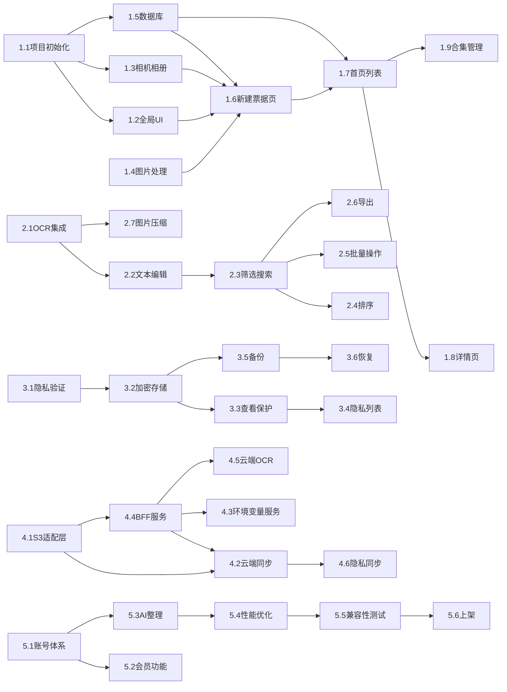

# 票密夹APP开发任务列表

Feature Name: ticket-vault
Created: 2026-04-02
Updated: 2026-04-02

## 任务统计

| 阶段 | 任务数 | 预估工时 |
|------|--------|----------|
| 第一阶段 | 15 | 3周 |
| 第二阶段 | 12 | 2周 |
| 第三阶段 | 10 | 2周 |
| 第四阶段 | 8 | 2周 |
| 第五阶段 | 7 | 2周 |
| 第六阶段 | 4 | 按需 |
| **总计** | **56** | **11周+** |

---

## 第一阶段：基础框架与核心页面

**目标**: 轻量化单机版APP，支持票据采集、处理、本地存储、合集管理

### 任务1.1：Flutter项目初始化
- [ ] 1.1.1 创建Flutter项目，配置项目名称和包名
- [ ] 1.1.2 配置pubspec.yaml依赖（hive、provider、opencv等）
- [ ] 1.1.3 配置Flutter项目结构目录
- [ ] 1.1.4 配置深色/浅色主题支持
- [ ] 1.1.5 配置应用图标和启动页

### 任务1.2：全局UI搭建
- [ ] 1.2.1 实现顶部导航栏组件
- [ ] 1.2.2 实现左侧圆形用户头像
- [ ] 1.2.3 实现中间LOGO和应用名称
- [ ] 1.2.4 实现右侧三点垂直菜单按钮
- [ ] 1.2.5 实现侧边抽屉菜单
- [ ] 1.2.6 实现首页、合集管理、隐私票据、设置、帮助与反馈导航

### 任务1.3：相机与相册集成
- [ ] 1.3.1 集成Flutter相机插件
- [ ] 1.3.2 实现拍照功能
- [ ] 1.3.3 集成相册选择功能
- [ ] 1.3.4 实现图片加载预览

### 任务1.4：OpenCV图片处理集成
- [ ] 1.4.1 集成OpenCV Flutter插件
- [ ] 1.4.2 实现自动扫描矫正功能
- [ ] 1.4.3 实现边框裁剪功能
- [ ] 1.4.4 实现自由角度旋转功能
- [ ] 1.4.5 实现缩放功能
- [ ] 1.4.6 实现清晰化功能
- [ ] 1.4.7 实现去阴影功能
- [ ] 1.4.8 实现图片处理异步处理

### 任务1.5：Hive数据库搭建
- [ ] 1.5.1 初始化Hive数据库
- [ ] 1.5.2 创建Ticket数据模型
- [ ] 1.5.3 创建Collection数据模型
- [ ] 1.5.4 实现票据CRUD操作
- [ ] 1.5.5 实现合集CRUD操作

### 任务1.6：新建票据页面
- [ ] 1.6.1 实现页面布局
- [ ] 1.6.2 实现标题输入框
- [ ] 1.6.3 实现OCR文本框
- [ ] 1.6.4 实现简介文本框
- [ ] 1.6.5 实现标签输入框
- [ ] 1.6.6 实现合集选择下拉框
- [ ] 1.6.7 实现位置输入/选择器
- [ ] 1.6.8 实现日期选择器
- [ ] 1.6.9 实现到期日期选择器
- [ ] 1.6.10 实现隐私票据开关
- [ ] 1.6.11 实现保存票据功能

### 任务1.7：首页票据列表
- [ ] 1.7.1 实现票据卡片组件
- [ ] 1.7.2 实现分页懒加载
- [ ] 1.7.3 实现新建票据按钮
- [ ] 1.7.4 实现下拉筛选菜单
- [ ] 1.7.5 实现全局搜索框
- [ ] 1.7.6 实现排序切换按钮
- [ ] 1.7.7 实现下拉刷新功能
- [ ] 1.7.8 实现上拉加载更多
- [ ] 1.7.9 实现长按多选功能
- [ ] 1.7.10 实现隐私票据小锁标识显示

### 任务1.8：票据详情页
- [ ] 1.8.1 实现页面布局
- [ ] 1.8.2 实现高清图片展示
- [ ] 1.8.3 实现完整元数据显示
- [ ] 1.8.4 实现编辑功能
- [ ] 1.8.5 实现更多操作菜单
- [ ] 1.8.6 实现设为隐私/取消隐私功能

### 任务1.9：合集管理功能
- [ ] 1.9.1 实现合集列表页面
- [ ] 1.9.2 实现新建合集功能
- [ ] 1.9.3 实现编辑合集名称/封面
- [ ] 1.9.4 实现删除合集功能
- [ ] 1.9.5 实现三种删除处理方式选择
- [ ] 1.9.6 实现查看合集中票据列表

---

## 第二阶段：本地OCR与票据管理

**目标**: 支持OCR识别、检索、批量操作的单机版APP

### 任务2.1：Google ML Kit OCR集成
- [ ] 2.1.1 集成ML Kit Text Recognition
- [ ] 2.1.2 实现动态模型下载功能
- [ ] 2.1.3 实现「识别文字」按钮
- [ ] 2.1.4 实现OCR任务串行控制
- [ ] 2.1.5 实现OCR结果自动填充
- [ ] 2.1.6 实现未完成任务提示

### 任务2.2：OCR文本编辑
- [ ] 2.2.1 实现OCR文本框编辑功能
- [ ] 2.2.2 实现文本复制功能

### 任务2.3：票据筛选与搜索
- [ ] 2.3.1 实现按标签筛选
- [ ] 2.3.2 实现按日期筛选
- [ ] 2.3.3 实现按合集筛选
- [ ] 2.3.4 实现全局搜索（标题+OCR内容）
- [ ] 2.3.5 实现搜索结果展示

### 任务2.4：票据排序
- [ ] 2.4.1 实现按时间升序排序
- [ ] 2.4.2 实现按时间降序排序
- [ ] 2.4.3 实现按名称排序

### 任务2.5：批量操作
- [ ] 2.5.1 实现多选模式切换
- [ ] 2.5.2 实现批量选择/取消
- [ ] 2.5.3 实现批量设为隐私
- [ ] 2.5.4 实现批量删除
- [ ] 2.5.5 实现二次确认弹窗
- [ ] 2.5.6 实现异步执行不阻塞UI

### 任务2.6：票据导出
- [ ] 2.6.1 实现图片导出功能
- [ ] 2.6.2 实现PDF导出功能

### 任务2.7：图片压缩与缓存
- [ ] 2.7.1 实现WebP格式压缩
- [ ] 2.7.2 实现缩略图生成
- [ ] 2.7.3 实现缩略图缓存（最大100张）
- [ ] 2.7.4 实现30天未访问缩略图清理
- [ ] 2.7.5 实现720P/1080P切换

---

## 第三阶段：隐私票据与本地备份

**目标**: 具备隐私保护与本地备份的完整版单机APP

### 任务3.1：隐私验证机制
- [ ] 3.1.1 实现隐私解锁页面
- [ ] 3.1.2 实现6位数字密码验证
- [ ] 3.1.3 实现复杂密码验证
- [ ] 3.1.4 实现生物识别验证
- [ ] 3.1.5 实现密码提示功能
- [ ] 3.1.6 实现忘记密码验证重置

### 任务3.2：隐私票据加密存储
- [ ] 3.2.1 实现AES-256-GCM加密服务
- [ ] 3.2.2 实现密钥生成
- [ ] 3.2.3 实现Android KeyStore集成
- [ ] 3.2.4 实现iOS Keychain集成
- [ ] 3.2.5 实现Hive加密盒存储隐私票据
- [ ] 3.2.6 实现独立存储目录方案

### 任务3.3：隐私票据查看保护
- [ ] 3.3.1 实现查看隐私票据详情需密码验证
- [ ] 3.3.2 实现锁屏/退出APP后自动锁定
- [ ] 3.3.3 实现内存密钥自动销毁
- [ ] 3.3.4 实现验证状态有效期管理

### 任务3.4：隐私票据列表
- [ ] 3.4.1 实现隐私票据页面布局
- [ ] 3.4.2 实现隐私票据筛选
- [ ] 3.4.3 实现隐私票据搜索（含/不含选项）
- [ ] 3.4.4 实现隐私票据排序

### 任务3.5：本地备份功能
- [ ] 3.5.1 实现手动备份功能
- [ ] 3.5.2 实现备份密码设置
- [ ] 3.5.3 实现AES-256加密ZIP打包
- [ ] 3.5.4 实现备份文件保存

### 任务3.6：本地恢复功能
- [ ] 3.6.1 实现备份文件选择
- [ ] 3.6.2 实现密码验证
- [ ] 3.6.3 实现数据解压解密
- [ ] 3.6.4 实现二次确认覆盖
- [ ] 3.6.5 实现数据还原

---

## 第四阶段：云端同步与环境变量服务

**目标**: 支持云端同步与云端OCR的完整APP，后端服务部署完成

### 任务4.1：S3同步适配层
- [ ] 4.1.1 设计S3适配层架构
- [ ] 4.1.2 实现S3协议接口
- [ ] 4.1.3 实现增量同步逻辑
- [ ] 4.1.4 实现数据结构对齐

### 任务4.2：云端同步功能
- [ ] 4.2.1 实现Wi-Fi自动同步
- [ ] 4.2.2 实现移动数据手动确认
- [ ] 4.2.3 实现图片断点续传
- [ ] 4.2.4 实现差分上传
- [ ] 4.2.5 实现同步状态展示
- [ ] 4.2.6 实现冲突处理
- [ ] 4.2.7 实现离线模式切换

### 任务4.3：1Panel环境变量服务
- [ ] 4.3.1 部署1Panel静态网站
- [ ] 4.3.2 配置HTTPS和HTTP基础认证
- [ ] 4.3.3 创建密钥存储JSON文件
- [ ] 4.3.4 实现APP加密请求获取密钥

### 任务4.4：BFF代理服务
- [ ] 4.4.1 搭建Node.js + Express服务
- [ ] 4.4.2 实现接口转发
- [ ] 4.4.3 实现鉴权机制
- [ ] 4.4.4 实现限流功能

### 任务4.5：云端OCR模块
- [ ] 4.5.1 集成讯飞OCR API
- [ ] 4.5.2 实现模块化解耦
- [ ] 4.5.3 实现云端OCR开关

### 任务4.6：隐私票据云端同步
- [ ] 4.6.1 实现隐私票据同步开关
- [ ] 4.6.2 实现加密密文上传

---

## 第五阶段：AI功能与优化上线

**目标**: 正式上线版APP，核心功能+可选扩展功能达标

### 任务5.1：账号体系
- [ ] 5.1.1 实现手机号注册
- [ ] 5.1.2 实现邮箱注册
- [ ] 5.1.3 实现登录功能
- [ ] 5.1.4 实现密码找回
- [ ] 5.1.5 实现密码修改
- [ ] 5.1.6 实现登录设备管理
- [ ] 5.1.7 实现异常登录强制下线

### 任务5.2：会员功能
- [ ] 5.2.1 设计会员体系架构
- [ ] 5.2.2 预留会员接口
- [ ] 5.2.3 实现免费/付费用户区分逻辑
- [ ] 5.2.4 实现订阅周期选择（月度/年度）
- [ ] 5.2.5 实现会员权益控制（云空间、OCR次数、AI次数）
- [ ] 5.2.6 实现会员到期处理

### 任务5.3：AI整理模块
- [ ] 5.3.1 集成讯飞星火大模型API
- [ ] 5.3.2 实现OCR完成后自动触发
- [ ] 5.3.3 实现简介生成
- [ ] 5.3.4 实现标签推荐
- [ ] 5.3.5 实现AI功能开关
- [ ] 5.3.6 删除「重新AI整理」按钮

### 任务5.4：性能优化
- [ ] 5.4.1 优化安装包体积（目标<25MB）
- [ ] 5.4.2 优化启动时间（目标<2.5s）
- [ ] 5.4.3 优化运行时帧率（目标>=60fps）
- [ ] 5.4.4 启用R8/ProGuard混淆

### 任务5.5：兼容性测试
- [ ] 5.5.1 Android多版本兼容测试
- [ ] 5.5.2 不同屏幕尺寸适配
- [ ] 5.5.3 深色/浅色主题测试

### 任务5.6：应用商店上架
- [ ] 5.6.1 准备应用商店素材
- [ ] 5.6.2 编写合规文档
- [ ] 5.6.3 提交应用商店审核
- [ ] 5.6.4 发布正式版

---

## 第六阶段：后续迭代功能

**目标**: 功能平滑扩展，按需开发

### 任务6.1：WebDAV备份
- [ ] 6.1.1 设计WebDAV接口
- [ ] 6.1.2 实现WebDAV连接配置
- [ ] 6.1.3 实现WebDAV备份上传
- [ ] 6.1.4 实现WebDAV恢复下载

### 任务6.2：阿里云短信登录
- [ ] 6.2.1 集成阿里云短信服务
- [ ] 6.2.2 实现验证码登录
- [ ] 6.2.3 实现短信验证注册

### 任务6.3：多设备直连同步
- [ ] 6.3.1 设计直连同步协议
- [ ] 6.3.2 实现设备发现
- [ ] 6.3.3 实现直连数据传输

### 任务6.4：发票验真与报销对接
- [ ] 6.4.1 集成发票验真服务
- [ ] 6.4.2 设计报销对接接口
- [ ] 6.4.3 实现报销单导出

---

## 依赖关系

---

## 里程碑

| 里程碑 | 完成标志 |
|--------|---------|
| M1: MVP | 完成阶段1+2+3，可上架内测 |
| M2: 云同步版 | 完成阶段4，可上架公测 |
| M3: 正式版 | 完成阶段5，正式发布 |
| M4: 扩展版 | 完成阶段6，持续迭代 |

---

## 需求追踪矩阵

| 需求ID | 需求名称 | 相关任务 |
|--------|---------|---------|
| 需求1 | 一站式票据新建 | 1.3, 1.4, 1.6 |
| 需求2 | 票据表单字段 | 1.6 |
| 需求3 | 首页票据列表 | 1.7, 2.3, 2.4 |
| 需求4 | 批量操作功能 | 2.5 |
| 需求5 | 票据详情页 | 1.8, 2.6 |
| 需求6 | 合集管理功能 | 1.9 |
| 需求7 | 隐私票据功能 | 3.1, 3.2, 3.3, 3.4 |
| 需求8 | 设置页面 | 3.5, 3.6, 5.1 |
| 需求9 | 本地OCR识别 | 2.1, 2.2 |
| 需求10 | 图片处理功能 | 1.4, 2.7 |
| 需求11 | 本地存储功能 | 1.5 |
| 需求12 | 本地备份与恢复 | 3.5, 3.6 |
| 需求13 | 云端同步功能 | 4.1, 4.2 |
| 需求14 | S3同步适配层 | 4.1 |
| 需求15 | 环境变量与BFF服务 | 4.3, 4.4 |
| 需求16 | 权限管理 | 1.1 |
| 需求17 | 性能优化 | 5.4 |
| 需求18 | 深色/浅色主题 | 1.1 |
| 需求19 | 侧边抽屉菜单 | 1.2 |
| 需求20 | 导航栏设计 | 1.2 |
| 需求21 | 账号体系 | 5.1 |
| 需求22 | 会员权益 | 5.2 |
